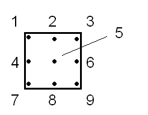
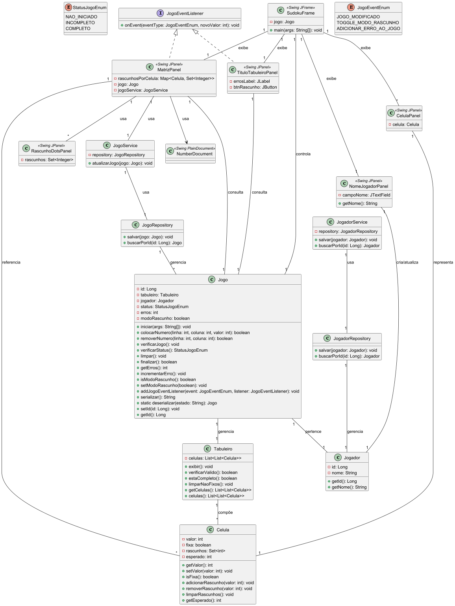

# Desafio de Projeto - Sudoku

## Objetivo

O objetivo é criar um jogo de Sudoku em Java, que permita ao usuário interagir com o jogo através de um menu. 
O jogo deve ser capaz de iniciar com um tabuleiro pré-definido, permitir a inserção e remoção de números, verificar 
o estado do jogo e fornecer feedback sobre erros.

*Esse projeto foi criado com base no desafio de projeto "Criando um Ebook com ChatGPT & MidJourney" do bootcamp
[TONNIE - Java and AI in Europe] na [DIO]*

## Tecnologias Utilizadas
- Java 21
- Swing (para interface gráfica)
- SQLite

### Desafio
Descrição completa do Desafio: [Desafio Sudoku Java]

#### Requisitos
Deve-se ter um menu interativo onde poderemos escolher entre as seguintes opções:
1. Iniciar um novo o jogo: Deve-se exibir na tela o jogo inicial, com os espaços preenchidos somente pelos números iniciais (usar os args do método main para informar os números iniciais e suas devidas posiçõers);
2. Colocar um novo número: Deve-se solicitar as seguintes informações do jogador (número a ser colocado, indice horizontal e indice vertical do número), não se deve permitir que seja colocado um número em uma posição que já esteja preenchida ( seja número fixo ou informado pelo jogador);
3. Remover um número: deve-se solicitar os índices verticais e horizontais do número que deseja remover ( caso o número seja um número fixo do jogo deve-se exibir uma mensagem informado que o número não pode ser removido);
4. Verificar jogo: Vizualizar a situação atual do jogo;
5. Verificar status do jogo: Deve-se verificar o status atual do jogo ( não iniciado, incompleto e completo) e se contém ou não erros ( o jogo está errado quando tem números em posições conflitantes) todos os status do jogo podem conter ou não erros, exceto o status não iniciado que é sempre sem erro;
6. Limpar: remove todos os números informados pelo usuário e mantém os fixos do jogo;
7. finalizar o jogo: Se o jogo estiver com todos os espaços preenchidos de forma válida o jogo é encerrado, senão informar ao usuário que ele deve preencher todos os espaços com seus respectivos números;

#### Extras (requisitos opcionais)
1. Usar algum ambiente gráfico ( AWT, Swing) para criação do jogo
2. ter a opção de colocar números de rascunho nos quadrados, para isso deve-se seguir o modelo proposto na sessão modelo de rascunho

##### Modelo com números


##### Modelo de rascunho


## Visuais

### Diagrama de Classes
  
O diagrama de classes acima representa a estrutura do projeto, incluindo as principais classes e suas relações.
Ele foi gerado utilizando o plugin do IntelliJ IDEA "PlantUML Integration" e o arquivo `class-diagram.puml` localizado na pasta `docs/diagrams`.

## Executar o projeto com o Banco de Dados (SQLite)

Abaixo seguem as instruções para executar o projeto com o banco de dados SQLite usando o JetBrains IntelliJ IDEA ou via terminal com a lib `sqlite-jdbc-3.50.1.0.jar`.

### Passos para execução
1. **Clone o repositório**  
   Clone o repositório do projeto para sua máquina local:
   ```sh
   git clone TODO: URL do repositório
   ``` 
2. **Abra o projeto no IntelliJ IDEA ou execute via terminal.**
   - **No IntelliJ IDEA**
       - Clique com o botão direito sobre `lib/sqlite-jdbc-3.50.1.0.jar` e selecione `Add as Library...`.

   - **Execução do projeto via terminal**
       - Compile o projeto incluindo o JAR no classpath:
         ```sh
         javac -cp ".;lib/sqlite-jdbc-3.50.1.0.jar" src/br/dev/zancanela/sudoku/**/*.java
         ```
       - Execute a aplicação incluindo o JAR no classpath:
         ```sh
         java -cp ".;lib/sqlite-jdbc-3.50.1.0.jar;src" br.dev.zancanela.sudoku.ui.custom.frame.SudokuFrame
         ```
       - No Linux/Mac, troque `;` por `:` no classpath.

3. **O banco de dados será criado automaticamente**  
   - O arquivo `sudoku.db` será gerado na raiz do projeto ao rodar a aplicação pela primeira vez.


[DIO]: https://www.dio.me/sign-up?ref=WQ0TRWQ8E1
[TONNIE - Java and AI in Europe]: https://www.dio.me/bootcamp/tonnie-java-and-ai-europe?ref=WQ0TRWQ8E1
[Desafio Sudoku Java]: https://github.com/digitalinnovationone/exercicios-java-basico/blob/main/projetos/2%20-%20Programa%C3%A7%C3%A3o%20Orientada%20a%20Objetos%20e%20Estruturas%20de%20Dados%20com%20Java.md